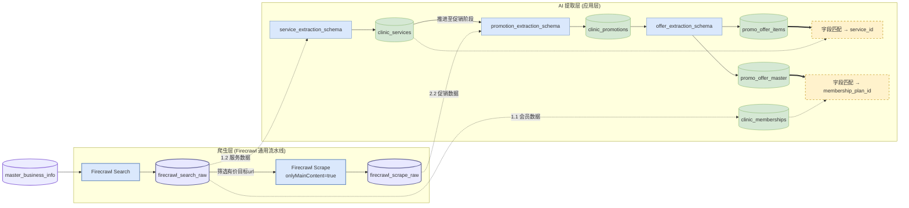

# CostFinder 数据流（规范快照）

> 表名以 `utils/schema_contract.py` 为准。会员 canonical：`clinic_memberships`。

## 节点说明

| 节点 | 写入时机 | 备注 |
| --- | --- | --- |
| `firecrawl_search_raw` | Search API 响应 | 价目/会员页 URL 发现；服务提取主输入 |
| `firecrawl_scrape_raw` | Scrape API 响应 | 仅 Search 命中含价格信号的 membership/promo URL |
| `clinic_memberships` | membership_extraction_schema | `plan_id` 供 master 关联 |
| `clinic_services` | service_extraction_schema | `service_id` 供 items 关联 |
| `clinic_promotions` | promotion_extraction_schema | 活动级，非 SKU |
| `promo_offer_master` | offer_extraction_schema | 价格/门槛/指纹 |
| `promo_offer_items` | offer_extraction_schema.items | 服务行 + 数量 |

## Legacy 提醒

- `promo_membership_plans`：旧表名，见 `LEGACY_MEMBERSHIP_TABLE`；新代码/Skill 以 `clinic_memberships` 为准。
- `promo_offer_master.service_id`：M009 前字段，已迁移到 `promo_offer_items.service_id`。
