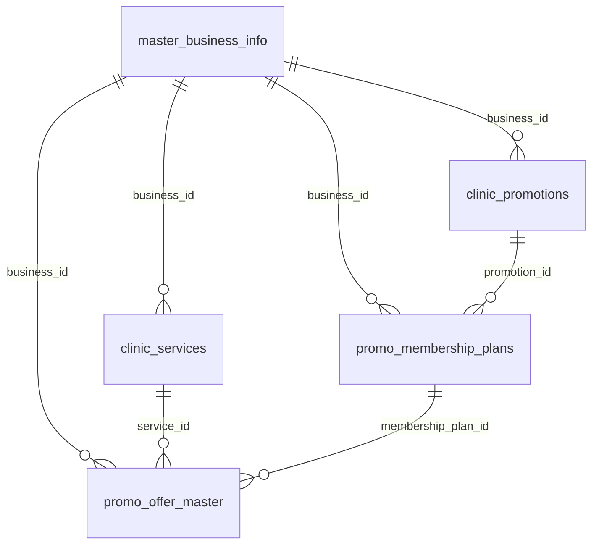
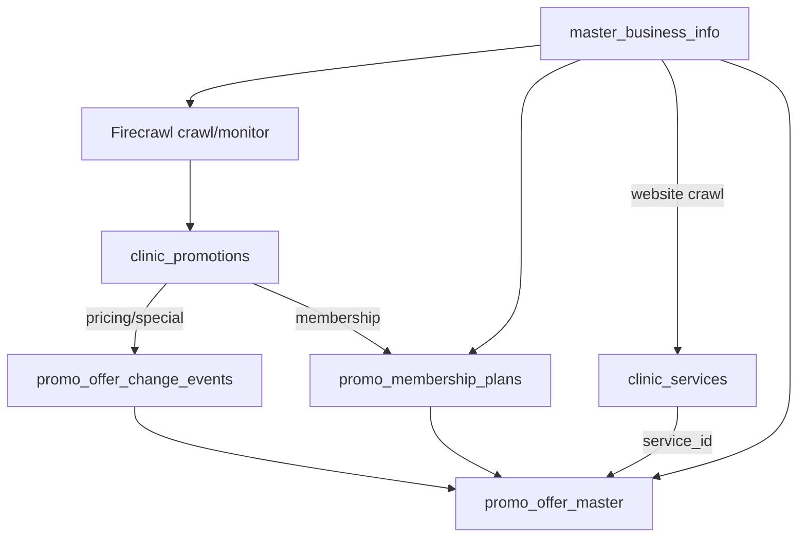

# 五表关系与数据流转 Pipeline

> 本文以 live Supabase 项目 `kdlpkjzcnbkjcvwsvlwn` 的实际 schema 为准（2026-07-15 核对）。  
> 行数参考：master 957 / promotions 248 / offers 2075 / plans 106 / clinic_services 0。`regular_price` 已可空（2026-07-15 核对）。

## 1. 总览：五层数据语义

CostFinder 把「诊所是谁」「有哪些促销活动」「常规价多少」「促销价多少」「会员档位是什么」拆成五张表，避免把订阅结构、目录价、限时促销混在同一行。


| 层      | 表                        | 职责                                |
| ------ | ------------------------ | --------------------------------- |
| 主档     | `master_business_info`   | 诊所身份、官网与社媒入口                      |
| 促销活动   | `clinic_promotions`  | 活动标题、来源 URL、渠道类型、有效期与校验状态（活动级，非 SKU） |
| 常规价目   | `clinic_services`        | 非促销的单位价服务目录                       |
| 促销 SKU | `promo_offer_master`     | 有时效的促销/会员价治疗报价                    |
| 会员结构   | `promo_membership_plans` | 档位月/年费与 benefits，本身不是治疗价          |


**价格语义区分：**

- `clinic_services.regular_price` — 诊所**常规目录**单位价（如 Botox $/unit）
- `promo_offer_master.regular_price` / `discount_price` — **促销页**上的对照价与成交价
- `promo_membership_plans.monthly_fee` / `annual_fee` — **订阅档位**费用，不是单次治疗价

---


## 2. 表关系（ER）




**关键外键含义：**

- `promo_offer_master.service_id` → `clinic_services`：把促销挂到常规服务，便于「目录价 vs 促销价」对比
- `promo_offer_master.membership_plan_id` → `promo_membership_plans`：把「会员价治疗 SKU」挂到具体档位
- `promo_membership_plans.promotion_id` → `clinic_promotions.promotion_id`：会员档位可追溯到所属促销活动

`master_business_info` 是所有业务数据的根；`clinic_promotions` 是促销活动主档（活动级），`source_url` 用于 C 端跳转与证据链溯源，SKU 级价格在 `promo_offer_master`。

---


## 3. 各表字段说明


### 3.1 `master_business_info`（诊所主档）


| 列                               | 类型             | 说明                |
| ------------------------------- | -------------- | ----------------- |
| `business_id`                   | bigint PK      | 全局业务主键            |
| `name`                          | text           | 诊所名称              |
| `address`, `city`               | text           | 地址与城市             |
| `category`                      | text           | 业态（如 Medical spa） |
| `website`                       | text           | 官网域名/URL，crawl 入口 |
| `facebook_url`, `instagram_url` | text           | 社媒链接              |
| `google_place_id`               | text           | Google Place 标识   |
| `review_count`, `score`         | bigint / float | 评价数量与评分           |
| `created_at`, `updated_at`      | timestamptz    | 审计时间戳             |


**角色：** 只读种子表。爬虫与提取管线从这里取 `business_id` 和 `website`，不在此表写 SKU 价。

---


### 3.2 `clinic_promotions`（促销活动）


| 列                     | 类型          | 说明                                                                  |
| --------------------- | ----------- | ------------------------------------------------------------------- |
| `promotion_id`        | bigint PK   | 促销活动唯一行 ID                                                          |
| `business_id`         | bigint FK   | → `master_business_info.business_id`（级联删除）                          |
| `promotion_title`     | text        | 促销活动/事件名称（例如："July 4th Specials", "2026七夕狂欢特惠"）                     |
| `source_url`          | text        | 促销活动来源的具体子页完整 URL（用于 C 端跳转和证据链溯源）                                   |
| `page_type`           | text        | 页面渠道类型：`membership`（会员特惠） / `special`（限时促销） / `pricing`（门市价目）       |
| `needs_ocr`           | boolean     | 该活动源头数据（如图片价格表）是否需要 OCR 补全                                          |
| `campaign_start_date` | date        | 促销活动整体有效期的开始时间（由 AI/脚本从文本中提炼，可为空）                                   |
| `campaign_end_date`   | date        | 促销活动整体有效期的截止时间（由 AI/脚本从文本中提炼，可为空）                                   |
| `is_verified`         | boolean     | 审计状态：是否通过反脏数据/防伪校验，默认为 true                                         |
| `created_at`          | timestamptz | 促销活动记录创建时间（默认 NOW()）                                               |
| `updated_at`          | timestamptz | 促销活动记录最近更新时间（默认 NOW()）                                             |


**角色：** 促销活动主档（活动级，非 SKU 级）。`page_type` 决定后续走会员提取还是促销提取；`source_url` 用于 C 端跳转与证据链溯源。

---


### 3.3 `clinic_services`（常规服务目录）


| 列                          | 类型                 | 说明                                          |
| -------------------------- | ------------------ | ------------------------------------------- |
| `service_id`               | bigint PK          | 服务行 ID                                      |
| `business_id`              | bigint FK NOT NULL | → `master_business_info.business_id`        |
| `service_name`             | text NOT NULL      | 服务名（如 Botox）                                |
| `regular_price`            | numeric            | **单位价**（$/unit 等）；可空，Search/crawl 回填前为 null |
| `unit_type`                | text               | 计价单位：`unit` / `syringe` / `area` / `vial`   |
| `service_area`             | text               | 身体区域（face、underarms 等），有则填                  |
| `created_at`, `updated_at` | timestamptz        | 审计时间戳                                       |


**角色：** 存放诊所**非促销**常规价。当前表为空，设计上由 `master.website` 全站 crawl 抽取单位价后写入。`promo_offer_master.service_id` 可引用此行做比价锚点。

---


### 3.4 `promo_offer_master`（促销/治疗 SKU）


| 列                                      | 类型                   | 说明                                          |
| -------------------------------------- | -------------------- | ------------------------------------------- |
| `id`                                   | bigint PK            | Offer 行 ID                                  |
| `business_id`                          | bigint FK            | → `master_business_info.business_id`        |
| `service_id`                           | bigint FK            | → `clinic_services.service_id`（可选，挂常规服务）    |
| `membership_plan_id`                   | bigint FK            | → `promo_membership_plans.plan_id`（会员价 SKU） |
| `status`                               | text NOT NULL        | `active` | `ended`；ended = monitor 检测到源页已移除 |
| `source_url`, `source_name`            | text                 | 促销来源页                                       |
| `regular_price`, `discount_price`      | numeric              | 对照原价与促销价                                    |
| `discount_amount`, `discount_percent`  | numeric / float      | 派生折扣额与百分比                                   |
| `delivered_unit`                       | float                | 套餐/促销包含的单位量（如 100 units）                    |
| `min_unit`                             | text                 | 最低购买单位描述                                    |
| `package_content`                      | jsonb                | 套餐内容结构化描述                                   |
| `is_package`, `is_membership_required` | boolean              | 是否套餐 / 是否需会员                                |
| `start_date`, `end_date`               | date                 | 促销有效期（SKU 级；活动级见 `campaign_*_date`）         |
| `offer_raw_text`                       | text                 | 原始提取文本                                      |
| `offer_fingerprint`                    | text                 | 去重指纹（同 URL + 服务 + 单位 → UPDATE 而非重复 INSERT）  |
| `created_at`                           | timestamptz NOT NULL | 创建时间                                        |


**角色：** 消费者比价的主表。一行 = 一个可比较的治疗促销 SKU。会员**档位费**不存这里，而是通过 `membership_plan_id` 关联 plans 表。

---


### 3.5 `promo_membership_plans`（会员档位）


| 列                               | 类型             | 说明                                          |
| ------------------------------- | -------------- | ------------------------------------------- |
| `plan_id`                       | bigint PK      | 档位 ID                                       |
| `business_id`                   | bigint FK      | → `master_business_info.business_id`        |
| `promotion_id`                  | bigint FK      | → `clinic_promotions.promotion_id`      |
| `domain_name`                   | text NOT NULL  | 站点域名                                        |
| `plan_name`                     | text NOT NULL  | 档位显示名                                       |
| `monthly_fee`, `annual_fee`     | numeric        | 月费 / 年费                                     |
| `billing_period`                | text NOT NULL  | 计费周期（默认 `monthly`）                          |
| `benefits`                      | jsonb NOT NULL | 权益列表（treatment / discount 等类型）              |
| `source_url`                    | text NOT NULL  | 会员页 URL（通常与活动 `source_url` 一致）              |
| `created_at`, `last_updated_at` | timestamptz    | 审计时间戳                                       |
| `deleted_at`                    | timestamptz    | 软删除                                         |


**角色：** 会员**结构**（月费、年费、权益 JSON）。若会员页还列出「会员价 Botox $8/unit」这类具体治疗价，仍写入 `promo_offer_master` 并挂 `membership_plan_id`。

**benefits 示例：**

```json
[
  {"type": "treatment", "desc": "One small area laser hair removal"},
  {"type": "discount", "desc": "20% off skincare"},
  {"type": "discount", "desc": "10% off injectables"}
]
```

---


## 4. 数据流转 Pipeline


### 4.1 主路径（日常生产）

```text
master_business_info
  │
  ├─ Firecrawl monitor 轮询 clinic_promotions.source_url
  │     （目标 URL 由 utils/monitor_target_urls.py 按域名选 1–2 条高分页）
  │
  ├─ 检测到有意义 diff → 门控重爬
  │     → 更新 clinic_promotions（promotion_title / campaign_*_date / needs_ocr / updated_at 等）
  │
  ├─ utils/change_driven_extractor.py
  │     ├─ LLM 提取变更 → promo_offer_change_events（审计）
  │     └─ 校验通过 → INSERT/UPDATE promo_offer_master（带 offer_fingerprint 去重）
  │
  └─ page_type = membership 的活动行
        └─ utils/membership_plans.py → promo_membership_plans（挂 promotion_id）
              └─ 有价 member treatment → promo_offer_master + membership_plan_id
```

**日常入口：** `scripts/firecrawl_monitor_poll.py`  
**不要与月度 fallback 同时跑。**

### 4.2 回退路径（手动 / 月度）

```text
scripts/monthly_refresh_promo_website_staging.py   # 全量重爬并刷新 clinic_promotions
scripts/detect_promo_website_staging_changes.py    # 全量比对来源页变更
```

用于 monitor 漏检或需要批量刷新时；与日常 monitor 路径互斥。

### 4.3 促销活动按 page_type 分流

```text
clinic_promotions
  │
  ├─ page_type = pricing / special
  │     → change-driven / LLM 提取
  │     → promo_offer_master
  │     → 可选：挂 service_id → clinic_services（目录服务锚点）
  │
  └─ page_type = membership
        → membership_plans 提取
        → promo_membership_plans（promotion_id）
        → 会员价治疗 SKU → promo_offer_master.membership_plan_id
```

`page_type` 取代布尔 `is_membership_page`，在活动层显式标记渠道角色，便于路由到不同提取器。

### 4.4 clinic_services 旁路（常规价目录）

**主路径（Firecrawl Cloud Search）：**

```text
master_business_info.website
  → 提取 domain → Firecrawl Search（include_domains + scrape_options）
  → 过滤价目页 URL（排除 /special、/promo 等）
  → 从 markdown 抽取单位价 / unit_type / service_area
  → INSERT/UPDATE clinic_services
  → promo_offer_master.service_id 可引用对应 service_id
```

- 脚本：`[scripts/seed_clinic_services_search.py](../scripts/seed_clinic_services_search.py)`
- 模块：`[utils/clinic_services_search.py](../utils/clinic_services_search.py)`、`[utils/clinic_services_db.py](../utils/clinic_services_db.py)`
- 环境：需云端 `FIRECRAWL_SEARCH_API_KEY`（自部署实例无 search）；可选 `FIRECRAWL_SEARCH_API_URL=https://api.firecrawl.dev`
- CLI：`--dry-run` / `--apply` / `--refresh-only --older-than-days 30` / `--fallback-crawl`

**回退路径（全站 crawl）：**

```text
master_business_info.website
  → Firecrawl crawl（自部署，limit≈15–50）
  → 抽取 → clinic_services
```

- 脚本：`[scripts/seed_clinic_services_botox.py](../scripts/seed_clinic_services_botox.py)` 或 search 脚本的 `--fallback-crawl`

与促销管线**独立**：日常路径不读 `promo_offer_master` 回填。`regular_price` 已允许 NULL（可先 seed 骨架行再回填）。

**一次性 bootstrap（offer 回填）：**

```text
promo_offer_master (service_name='Botox')
  → 每 business 选 winner offer（仅 regular_price，不用 discount_price）
  → UPDATE clinic_services Botox 骨架行
  → 可选：全部 Botox offer 写 service_id
```

- 脚本：`[scripts/backfill_clinic_services_from_offers.py](../scripts/backfill_clinic_services_from_offers.py)`
- 模块：`[utils/clinic_services_from_offers.py](../utils/clinic_services_from_offers.py)`
- CLI：`--dry-run` / `--apply` / `--link-offers` / `--force`


### 4.5 端到端示意




---


## 5. Schema 更新的目的


### 5.1 `master_business_info` 精简

去掉爬虫/消费者不需要的字段（如内部处理标记、embedding、冗余清洗列），只保留身份、位置、官网、社媒与评价。所有下游表通过 `business_id` 统一关联。

### 5.2 会员拆表（`promo_membership_plans`）

原先会员月费、计费周期、权益混在 `promo_offer_master` 一行，导致：

- 档位费与治疗 SKU 价无法区分
- benefits 无法结构化存储
- 同一档位下多个会员价治疗难以关联

拆表后：plans 存结构，offers 存有价 SKU，经 `membership_plan_id` 连接；plans 经 `promotion_id` 挂回所属促销活动。

### 5.3 常规价目录（`clinic_services` + `service_id`）

新增 `clinic_services` 并在 offers 上加 `service_id`，支持：

- 目录常规价与促销价并排比较
- 同一服务（如 Botox）在不同渠道（常规页 vs 促销页）的价格锚定
- 促销 SKU 不必重复承载「这家诊所 Botox 平时多少钱」


### 5.4 促销活动用 `page_type` 分流

用显式枚举 `membership | special | pricing` 标记活动渠道角色，替代单一布尔会员标记，使 monitor、提取器、会员 backfill 可以按类型路由，减少误提取。

### 5.5 促销活动主档（相对旧 staging 页缓冲）

活动行只保留活动级字段（`promotion_title`、`source_url`、`campaign_*_date`、`is_verified` 等），不再把整页 `page_content` 当作消费者语义；溯源靠 `source_url`，SKU 价在 offers，活动有效期与 SKU 有效期（`start_date` / `end_date`）分层。

### 5.6 Offers 增强字段

- `offer_fingerprint`：防止 monitor 重提时重复 INSERT（同 URL + 服务 + 单位 → UPDATE）
- `package_content` / `delivered_unit` / `min_unit`：表达套餐量级（如「100 units Botox 套餐」）
- `status` active/ended：源页移除时软结束，保留历史

---


## 6. 相关脚本与模块


| 环节                        | 模块 / 脚本                                            |
| ------------------------- | -------------------------------------------------- |
| 五表质量审计                    | `scripts/audit_extraction_quality.py` + `utils/extraction_quality_audit.py` |
| 确定性修复                     | `scripts/apply_extraction_repairs.py` + `utils/extraction_repair.py` |
| 集中写入路由                   | `utils/extraction_persist.py`（`route_and_persist_extraction`） |
| Live schema 契约             | `utils/schema_contract.py` + `schema/live_schema_snapshot.json` |
| 促销活动写入 / 重爬               | `crawler/staging_recrawl.py`                       |
| 日常变更提取                    | `utils/change_driven_extractor.py`                 |
| 会员提取                      | `utils/membership_plans.py`                        |
| Offer 过滤                  | `utils/offer_scope_filter.py`（排除纯咨询/纯档位费/护肤品）      |
| Monitor 轮询                | `scripts/firecrawl_monitor_poll.py`                |
| 月度回退                      | `scripts/monthly_refresh_promo_website_staging.py` |
| clinic_services Search（主） | `scripts/seed_clinic_services_search.py`           |
| clinic_services offer 回填  | `scripts/backfill_clinic_services_from_offers.py`  |
| clinic_services crawl（回退） | `scripts/seed_clinic_services_botox.py`            |


更完整的项目架构见 [README.md](../README.md)。
