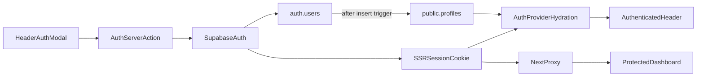

# 消费者注册登录设计

## 目标与范围

为 CostFinders 前端完善普通消费者的邮箱密码注册登录。复用现有 Supabase Auth、Header 弹窗、Server Actions 和 Auth Context，不新增认证依赖。

本次包含：

- 邮箱密码注册、登录、退出和找回密码
- 注册后直接建立会话，不强制邮箱或手机验证
- `profiles` 用户资料表、自动建档触发器和 RLS
- `/dashboard/**` 服务端保护及客户端兜底
- 认证错误反馈、验证和文档同步

本次不包含：

- Google、Magic Link 或其他第三方登录
- 商家和管理员认证改造
- claims、messages 等消费者业务表建设
- 手机验证

## 现状与根因

前端已存在完整的消费者认证外壳：

- `frontend/src/components/features/signUpForm.tsx`
- `frontend/src/components/features/signInForm.tsx`
- `frontend/src/components/features/authModal.tsx`
- `frontend/src/lib/actions/auth.ts`
- `frontend/src/lib/context/authContext.tsx`
- `frontend/src/proxy.ts`

当前连接的 Supabase 项目没有 `public.profiles`。Auth 用户即使创建成功，`AuthProvider` 也无法加载 profile，因此会将用户视为未登录。现有弹窗还会在注册和登录后强制进入邮箱、手机验证流程，与本次“不强制验证”的产品要求冲突。`proxy.ts` 已有保护逻辑，但必须通过构建和运行验证确认 Next.js 16 已发现并执行它。

## 架构

继续使用 `@supabase/ssr` 的浏览器端和服务端客户端。浏览器只接触 Supabase publishable key；认证写入由 Server Actions 发起，会话存储在 SSR Cookie 中。

## 数据模型与安全

新增项目现有迁移风格的消费者认证迁移，创建 `public.profiles`：

- `id uuid primary key references auth.users(id) on delete cascade`
- 姓名、头像、电话、位置、通知偏好等现有 `Profile` 类型依赖字段
- `verification_status` 默认 `unverified`
- `status` 默认 `active`
- 创建、更新时间和最近登录时间

在 `auth.users` 插入后，通过最小 `SECURITY DEFINER` 触发器为未声明商家/管理员角色的消费者创建 profile，并从 `raw_user_meta_data` 读取 `first_name`、`last_name`。函数固定空 `search_path` 并使用完整限定表名，避免让商家或管理员账户同时获得消费者 profile。

`profiles` 开启 RLS。`authenticated` 角色只能读取和更新 `id = auth.uid()` 的行；UPDATE 同时配置 `USING` 与 `WITH CHECK`。不允许匿名读取资料，不使用 service role 处理常规登录流。

关闭 Supabase Auth 的 Confirm email，使注册成功直接返回会话。`verification_status=unverified` 不阻塞登录，也不会把未经验证的邮箱显示为已验证。

## 用户流程

### 注册

1. 用户从 Header 或需要登录的业务入口打开注册弹窗。
2. 表单校验邮箱、至少 8 位密码、确认密码和可选姓名。
3. Server Action 调用 `supabase.auth.signUp`。
4. 数据库触发器创建 profile。
5. Auth Context 加载用户和 profile。
6. 弹窗关闭，Header 显示 Dashboard 入口，用户留在当前页面。

### 登录与受保护页面

1. 登录成功后 Auth Context 刷新 profile 和会话状态。
2. 普通入口登录后留在当前页面。
3. 未登录用户直接访问 `/dashboard/**` 时，Proxy 重定向首页并携带目标路径。
4. 首页自动打开登录弹窗；成功后返回原目标页。
5. 客户端 dashboard layout 只作为加载态和失效会话的兜底，不能替代服务端保护。

### 找回密码与退出

找回密码继续使用统一成功文案，避免暴露邮箱是否存在。退出通过服务端 Action 清理会话，并立即清空客户端用户状态。

Magic Link、注册后邮箱验证弹窗和手机验证弹窗不再属于消费者首版认证流程。

## 错误处理

- 无效凭据返回统一的邮箱或密码错误。
- 重复注册、弱密码和 Supabase 限流返回可操作但不过度暴露账户状态的提示。
- 网络和未知异常记录服务端上下文，客户端显示通用重试提示。
- profile 缺失不能静默表现为“未登录”；应返回明确的账户初始化失败提示。
- 提交期间禁用按钮并保留输入，防止重复请求。
- 环境变量未配置时保持现有公开页面降级，但认证入口不可展示为可用。

## 验证

1. 迁移前只读检查目标表、触发器和策略是否存在。
2. 应用迁移后断言：
   - `profiles` 字段、主键和 `auth.users` 外键正确
   - RLS 已启用
   - SELECT/UPDATE 所有权策略存在
   - 新用户触发器存在
3. 运行前端 Biome 检查和 Next.js production build，确认 Proxy 被构建发现。
4. 用一次性测试邮箱走通：
   - 注册并自动登录
   - profile 自动创建且姓名正确
   - `/dashboard` 可访问
   - 退出后 `/dashboard` 被拦截
   - 再次登录成功
   - 找回密码返回统一成功提示
5. 验证完成后删除测试 Auth 用户，依赖级联删除 profile。

## 文档

实施完成后更新：

- `README.md`：补充消费者认证和数据库迁移入口
- `frontend/docs/ROUTES.md`：修正 Proxy 与受保护路由说明
- 前端环境变量示例：只记录变量名和用途，不提交任何密钥

## 验收标准

- 新消费者可通过邮箱密码注册并立即成为登录状态。
- 每个 Auth 用户自动拥有且只能访问自己的 profile。
- 刷新页面后会话仍有效，Header 状态正确。
- 未登录用户无法在服务端获取 `/dashboard/**` 页面。
- 登录、退出和找回密码具有明确且不泄露账户状态的反馈。
- Magic Link 和强制邮箱、手机验证不再出现在消费者认证流程。
